# 📚 Hybrid-Cloud RAG Pipeline


A high-performance **Retrieval-Augmented Generation (RAG)** system built to handle private documents with **zero local hardware dependencies**.  
This project utilizes a hybrid-cloud architecture to provide high-performance document intelligence without requiring local GPU resources.

---

## 🚀 Architecture (The "Why")

This project was specifically designed to overcome common hardware limitations (DLL errors and SQLite version conflicts) often found in Windows environments by using a **Hybrid-Cloud** approach.

### Tech Stack

- **LLM:** Groq (Llama 3.3-70B) — Chosen for ultra-fast inference speeds  
- **Embeddings:** Hugging Face Serverless API (`all-MiniLM-L6-v2`) — Moves mathematical vectorization to the cloud, avoiding heavy local PyTorch/ONNX dependencies  
- **Vector Store:** FAISS (Facebook AI Similarity Search) — Selected over ChromaDB for better cross-platform stability and lightweight CPU performance  
- **Orchestration:** LangChain (v0.3.x) — Using the modern `create_retrieval_chain` architecture  

---

## 🏗️ Architecture Diagram

```mermaid
graph LR
    subgraph Ingestion["📥 Document Ingestion"]
        A[📄 User Documents<br/>PDF/TXT] --> B[✂️ Text Splitter<br/>1000 chars, 150 overlap]
        B --> C[☁️ Hugging Face API<br/>all-MiniLM-L6-v2]
        C -->|384-dim vectors| D[(🗄️ FAISS<br/>Vector Store)]
    end
    
    subgraph Query["🔍 Query Processing"]
        E[❓ User Question] --> F[🔎 Similarity Search]
        D -.->|retrieve| F
        F -->|Top 3 chunks| G[📝 Context Builder]
    end
    
    subgraph Generation["⚡ Answer Generation"]
        G --> H[🤖 Groq LLM<br/>Llama 3.3-70B]
        H -->|fact-based| I[✅ Answer]
    end
    
    style D fill:#e1f5ff
    style H fill:#fff4e1
    style I fill:#e8f5e9
```



---

## 🛠️ Installation

### 1. Clone the repository
```bash
git clone https://github.com/pramayharsh/hybrid-cloud-rag.git
cd hybrid-rag-pipeline
```

### 2. Create a virtual environment
```bash
python -m venv venv
source venv/bin/activate   # Windows: venv\Scripts\activate
```

### 3. Install dependencies
```bash
pip install -r requirements.txt
```

### 4. Configure environment variables

Create a `.env` file in the project root:
```env
GROQ_API_KEY=your_key
HUGGINGFACEHUB_API_TOKEN=your_key
```

---

## 📖 How It Works

### Ingestion

Documents (`.pdf` or `.txt`) are loaded and split into:

- **Chunk size:** 1000 characters  
- **Overlap:** 150 characters  

This preserves context across chunks.

### Vectorization

Chunks are sent to the Hugging Face API and converted into **384-dimensional embeddings**.

### Storage

Vectors are stored in a **FAISS index** for high-speed similarity searching.

### Retrieval

When a user asks a question, the **top 3 most relevant chunks** are retrieved.

### Generation

The retrieved context and question are passed to **Llama 3.3 via Groq** to generate a fact-based response.

---

## 📂 Project Structure
```text
rag-project/
├── src/
│   ├── __init__.py
│   ├── database.py         # FAISS Vector Store logic
│   ├── embeddings_logic.py # HF Cloud Embedding logic
│   └── llm_logic.py        # Groq LLM configuration
├── data/                   # (Optional) Store your PDFs here
├── .env                    # Secret API Keys (ignored by git)
├── .gitignore              # Files to exclude from version control
├── Dockerfile              # Containerization instructions
├── LICENSE                 # MIT License
├── main.py                 # Interactive CLI entry point
├── requirements.txt        # Project dependencies
└── README.md               # Project documentation
```

---

## 🛠️ Usage Examples (CLI)

### Chatting with your documents

Once initialized, the system enters an interactive loop:
```bash
python main.py
```
```text
--- 📚 Modern RAG System Initializing ---
✅ System Ready! Ask a question:
You: What is the project budget?
AI: According to the document, the budget is $2.4M for Q1.
```

---

## 🐳 Docker Support

### Build the image
```bash
docker build -t hybrid-rag-app .
```

### Run the container

Pass your API keys as environment variables for security:
```bash
docker run -it \
  -e GROQ_API_KEY="your_key" \
  -e HUGGINGFACEHUB_API_TOKEN="your_key" \
  hybrid-rag-app
```

---

## 🧪 Testing the RAG System

To verify that the system uses document data rather than pre-trained knowledge:

- Use the provided `test_facts.txt` file  
- Ask questions about the fictional **"Nebula-X"** project  
- Confirm responses are derived only from the document content

---

## 🚀 Key Features

- **Cross-Platform Compatibility** — Replaced ChromaDB with FAISS to bypass SQLite version conflicts on Windows/Linux  
- **Serverless Embeddings** — Uses Hugging Face Inference API to reduce local memory footprint  
- **Ultra-Low Latency** — Powered by Groq's LPU (Language Processing Unit) for near-instant responses  
- **Smart Chunking** — Implements `RecursiveCharacterTextSplitter` for optimal context preservation  
- **No GPU Required** — Production-ready hybrid-cloud architecture

---

## 📄 License

Distributed under the MIT License. See the `LICENSE` file for more information.

---

## 🤝 Contributing

Pull requests are welcome. For major changes, please open an issue first to discuss your proposal.

---

## ⭐ Support

If you find this project useful, consider giving the repository a star ⭐